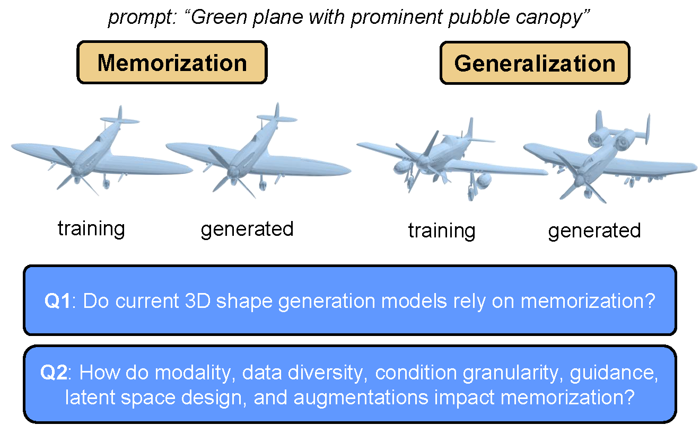
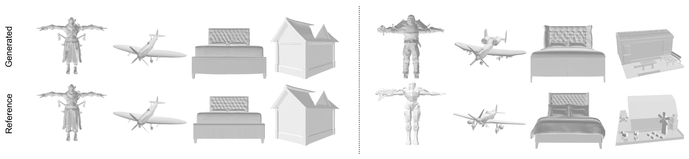

# [Memorization in 3D Shape Generation](https://arxiv.org/abs/24XX.XXXXX)
**Authors:** [Shu Pu](https://urrealhero.github.io/MyPersonalWeb/), [Boya Zeng](https://boyazeng.github.io/), Kaichen Zhou, [Mengyu Wang](https://wang.hms.harvard.edu/), [Zhuang Liu](https://liuzhuang13.github.io/)

Official implementation of [**"Memorization in 3D Shape Generation: An Empirical Study"**]((https://arxiv.org/abs/24XX.XXXXX)). This repository contains our evaluation framework for quantifying memorization ($Z_U$) and measuring generation quality (FPD), and the training code for our vector-set diffusion models (`hy3dshape`).

<div align="center">
  
  <br/>
  <i>In this paper, we propose a framework to evaluate memorization in 3D shape generation and use it to quantify the memorization in existing methods and understand how data and modeling designs impact memorization.</i>
</div>

<br/>

<div align="center">
  
  <br/>
  <i>Qualitative results of memorization and generalization cases generated by Trellis.</i>
</div>

-----


## 0\. Environment Setup

Basic dependencies for most parts of the codebase are listed in `requirements.txt`. For light-field-distance, please refer to the [instruction](./retrieval/README.md).
```bash
pip install -r requirements.txt
```

## 1\. Evaluation Framework

### Step 1: LFD Retrieval

Navigate to `retrieval/` to perform nearest-neighbor retrieval. This step generates the JSON files containing distances from generated samples ($Q$) and test samples ($P_{test}$) to the training set ($T$).

We recommend using **Light Field Distance (LFD)** as the retrieval metric, as it was found to be the most accurate in our benchmarks.

### Step 2: Memorization test ($Z_U$)

Navigate to `DataCopying/` to calculate the $Z_U$ score. This metric determines if the generative model is memorizing training data.

**Usage:**

```bash
cd DataCopying
python datacopying_test.py gen_retrieval_results.json test_retrieval_results.json
```

### Step 3: Quality evaluation (FPD)

You can get Uni3D embedding database from `retrieval/` [README](./retrieval/README.md).

```bash
cd fpd_eval
python npz_eval.py reference.npz generated.npz
```

> **Suggestion:**: You can normalize using the global training set statistics $\mu_R, \Sigma_R$ before saving them to `.npz`.

-----

## 2\. Model (`hy3dshape/`)

The `hy3dshape/` directory contains the implementation of our 3D generative models. 

### Training
Our experiment use the `point_vec1024x32_dim1024_depth24_sdf_nb` in [VecSetX](https://github.com/1zb/VecSetX) autoencoder, to download the pretrained weights, please follow the instructions in the its repository. 


We provide a simple training command below. Please modify the configuration file path, output directory, and other parameters as needed.
```
python main.py --fast -c PATH/TO/CONFIG.yaml -nn 1 -ng 8 -a --amp_type 32 --output_dir PATH/TO/OUTPUT_DIR (--deepspeed --ckpt_path PATH/TO/CHECKPOINT/FOR/AUTO_RESUME)
```

You can find example configuration files in `hy3dshape/configs/`.
Most of the training settings can be modified through the configuration file.


### Inference
We provide simple inference commands below. 

**Text-conditional generation**
```
python inference.py \
    --config configs/Baseline.yaml \
    --ckpt PATH/TO/CHECKPOINT \
    --out_dir outputs_text/ \
    --num_samples 4 \
    --text "a chair"
```

**Class-conditional generation**
Details of the mapping from class names to class IDs can be found in `utils/mapping.json`.
```
python inference.py \
    --config configs/Conditioning/LVIS-16-Category.yaml \
    --ckpt PATH/TO/CHECKPOINT \
    --out_dir outputs_lvis/ \
    --num_samples 4 \
    --class_id 0
```

**Image-conditional generation**
```
python inference.py \
    --config configs/Conditioning/Image.yaml \
    --ckpt PATH/TO/CHECKPOINT \
    --out_dir outputs_image \
    --num_samples 1 \
    --image_path data_sprite.png \
    --image_views 12 \
    --image_pick random
```


-----

## 3\. Data Curation & Captioning

  * **`data_curation/`**: Contains our pipeline for filtering Objaverse-LVIS, removing mislabeled data using Qwen3, and preparing the dataset.
  * **`mvcaption/`**: Our Multi-View Captioning strategy to generate robust text descriptions.

Please refer to the README files inside those directories for detailed usage instructions.


## 4\. Acknowledgements

We deeply appreciate the open-source contributions that made this research possible. We would like to specifically acknowledge and thank the authors of the following projects for their excellent work:

* **[sdf_gen](https://github.com/1zb/sdf_gen?tab=readme-ov-file)**: Used for mesh normalization and SDF generation processing.
* **[LFD](https://github.com/kacperkan/light-field-distance) and [GET3D](https://github.com/nv-tlabs/GET3D)**: For Light Field Distance (LFD) implementation.
* **[data-copying](https://github.com/casey-meehan/data-copying/tree/master)**: The original implementation of the Data Copying Test ($Z_U$), which serves as the core of our memorization evaluation.
* **[3DShape2Vecset (VecSetX)](https://github.com/1zb/VecSetX)**: For the Vecset autoencoder used in our experiments.
* **[Hunyuan3D 2.1](https://github.com/Tencent-Hunyuan/Hunyuan3D-2.1)**: For providing the robust diffusion backbone and training framework.


## Citation
If you find our work or code useful for your research, please consider citing:
```text
@article{
  Placeholder
}
```